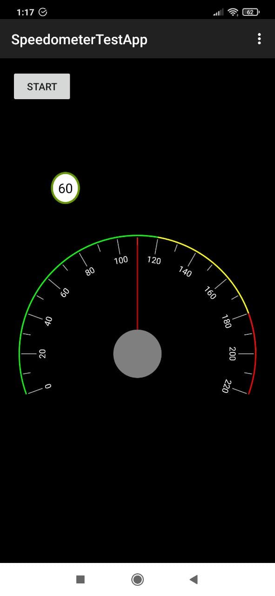

Speedometer Application
=========================

## Usage
Display of the speedometer, whose value is time dependent

## Description
":app" - application module with MainActivity

":main" - library for display of the speedometer

":service" - service in a separate process for generating speed values for the speedometer

At the very beginning, it is necessary to specify the path to the NDK in local.properties

## Example

